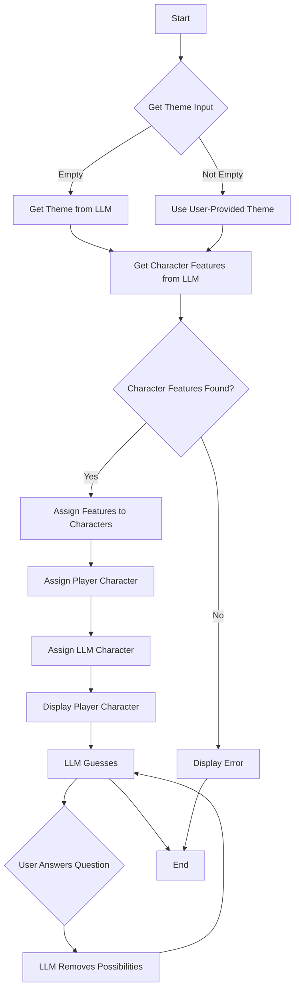

# Guess Llama? Game

## Description

This is a C++ implementation of the classic "Guess Who?" game, enhanced with the power of Language Models (LLMs). The game leverages an LLM to dynamically generate themes and character features, providing a unique and endlessly replayable experience. Players can either provide their own theme or let the LLM generate one. The LLM also helps in the gameplay by asking questions to guess the player's character.

## Dependencies

-   curl: Used for making HTTP requests to the LLM server.
-   rapidjson: A fast JSON parser and generator for C++.

## Compilation

To compile the game, you need to have `g++`, `curl`, and `rapidjson` installed. Ensure that the curl and rapidjson libraries are installed on your system. You can then compile the game using the following command:

```bash
g++ guess_llama.cpp -lcurl -o guess_llama
```

After compiling, you can run the game:

```bash
./guess_llama
```

## Usage

When you run the game, you will be prompted to enter a theme. You can either enter a theme of your choice or leave it blank to have the LLM generate a random theme for you. After the theme is selected, the LLM will generate a set of character features. The game will then assign a character to you, and the LLM will start asking questions to guess your character. The LLM will ask a series of yes/no questions, and based on your answers, it will attempt to narrow down the possibilities and eventually guess your character. The game currently runs for a fixed number of rounds.

## Example

Here's an example of how to run the game and the kind of output you can expect:

```bash
./guess_llama
```

```text
Enter a theme for the game (or leave blank for a random theme): Capybara
Using theme: Capybara
Character features:
- Wearing Sunglasses
- Has a Flower Behind Ear
- Wet Fur
- Missing a Tooth
- Wearing a Bandana
- Long Whiskers
- Has a Small Scar
- Eating a Fruit

Character Traits:
Character 1: Eating a Fruit, Wearing a Bandana
Character 2: Has a Flower Behind Ear, Wearing a Bandana, Long Whiskers
Character 3: Wearing a Bandana, Eating a Fruit, Missing a Tooth
Character 4: Long Whiskers, Has a Flower Behind Ear
Character 5: Wearing a Bandana, Missing a Tooth, Has a Small Scar
Character 6: Wearing a Bandana, Wearing Sunglasses
Character 7: Missing a Tooth, Long Whiskers, Wet Fur
Character 8: Has a Small Scar, Missing a Tooth
Character 9: Has a Small Scar, Wet Fur
Character 10: Wearing a Bandana, Has a Small Scar
Character 11: Has a Flower Behind Ear, Long Whiskers, Wearing a Bandana
Character 12: Wearing a Bandana, Missing a Tooth, Eating a Fruit
Character 13: Wearing a Bandana, Wearing Sunglasses
Character 14: Missing a Tooth, Long Whiskers
Character 15: Has a Flower Behind Ear, Missing a Tooth
Character 16: Has a Small Scar, Wearing a Bandana, Has a Flower Behind Ear
Character 17: Wearing Sunglasses, Long Whiskers
Character 18: Wearing a Bandana, Has a Small Scar
Character 19: Has a Flower Behind Ear, Long Whiskers
Character 20: Has a Small Scar, Has a Flower Behind Ear, Wearing Sunglasses
Character 21: Missing a Tooth, Wet Fur
Character 22: Wearing a Bandana, Has a Flower Behind Ear
Character 23: Has a Small Scar, Long Whiskers, Missing a Tooth
Character 24: Wearing a Bandana, Wearing Sunglasses, Long Whiskers

You are character number 21
LLM asks: Is the character wearing sunglasses?
Is this true for your character? (yes/no): no
LLM suggests eliminating characters: 6, 13, 17, 20, 24
```

## Flowchart


