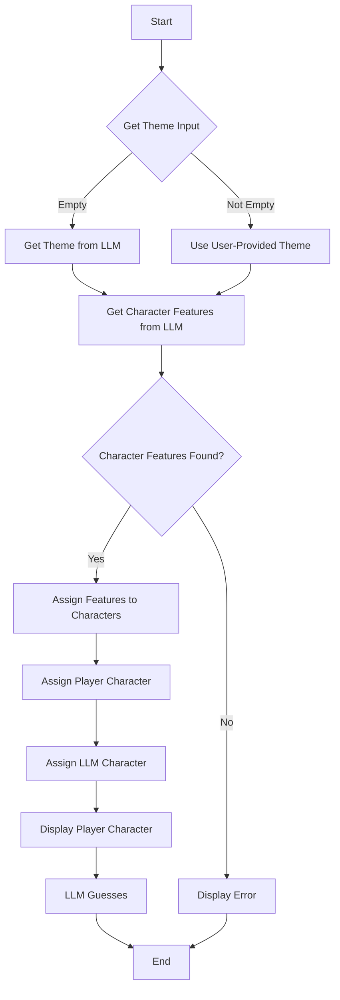

# Guess Llama? Game

## Description

This is a C++ implementation of the classic "Guess Who?" game, enhanced with the power of Language Models (LLMs). The game leverages an LLM to dynamically generate themes and character features, providing a unique and endlessly replayable experience. Players can either provide their own theme or let the LLM generate one. The LLM also helps in the gameplay by asking questions to guess the player's character.

## Dependencies

-   curl: Used for making HTTP requests to the LLM server.
-   rapidjson: A fast JSON parser and generator for C++.

## Compilation

To compile the game, you need to have `g++`, `curl`, and `rapidjson` installed. Ensure that the curl and rapidjson libraries are installed on your system. You can then compile the game using the following command:

```bash
g++ guess_llama.cpp -lcurl -o guess_llama
```

After compiling, you can run the game:

```bash
./guess_llama
```

## Usage

When you run the game, you will be prompted to enter a theme. You can either enter a theme of your choice or leave it blank to have the LLM generate a random theme for you. After the theme is selected, the LLM will generate a set of character features. The game will then assign a character to you, and the LLM will start asking questions to guess your character.

## Example

Here's an example of how to run the game and the kind of output you can expect:

```bash
./guess_llama
```

```text
Enter a theme for the game (or leave blank for a random theme): Capybara
Using theme: Capybara
Character features:
- Wearing sunglasses
- Has a flower on head
- Large front teeth
- Wet fur
- Eating a carrot
- Has a shell on back
- Missing a toe
- Wearing a bandana

Character Traits:
Character 1: Missing a toe, Wet fur
Character 2: Has a shell on back, Has a flower on head
Character 3: Missing a toe, Eating a carrot
Character 4: Missing a toe, Wet fur
Character 5: Wearing a bandana, Has a flower on head
Character 6: Large front teeth, Has a shell on back, Wet fur
Character 7: Wet fur, Has a flower on head, Large front teeth
Character 8: Eating a carrot, Wearing sunglasses
Character 9: Wet fur, Large front teeth, Missing a toe
Character 10: Large front teeth, Wearing sunglasses
Character 11: Missing a toe, Large front teeth, Eating a carrot
Character 12: Wearing sunglasses, Has a flower on head, Has a shell on back
Character 13: Has a shell on back, Wet fur, Large front teeth
Character 14: Has a flower on head, Wearing a bandana
Character 15: Wearing sunglasses, Large front teeth
Character 16: Wearing sunglasses, Eating a carrot, Wearing a bandana
Character 17: Wet fur, Wearing sunglasses
Character 18: Eating a carrot, Has a flower on head
Character 19: Missing a toe, Wet fur
Character 20: Wearing a bandana, Eating a carrot, Large front teeth
Character 21: Eating a carrot, Wearing sunglasses, Wet fur
Character 22: Wearing a bandana, Missing a toe, Has a flower on head
Character 23: Missing a toe, Has a flower on head
Character 24: Eating a carrot, Wet fur

You are character number 16
LLM asks: Does the character have a shell on their back?
```

## Flowchart


