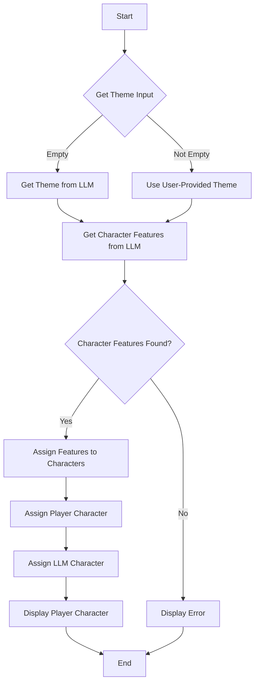

# Guess Llama? Game

## Description

This is a C++ implementation of the classic "Guess Who?" game. The game uses an LLM (Language Model) to generate themes and character features, adding a unique and dynamic twist to the traditional gameplay.

## Dependencies

-   curl: Used for making HTTP requests to the LLM server.
-   rapidjson: A fast JSON parser and generator for C++.

## Compilation

To compile the game, you need to have `g++`, `curl`, and `rapidjson` installed. Use the following command:

`g++ guess_llama.cpp -lcurl -o guess_llama && ./guess_llama`

