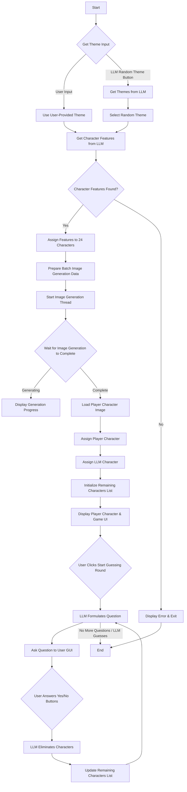

# Guess Llama? Game

## Description

This is a C implementation of the classic "Guess Who?" game, enhanced with the power of Language Models (LLMs) and a graphical user interface (GUI) built with Raylib. The game leverages an LLM to dynamically generate themes and character features, providing a unique and endlessly replayable experience. It also integrates with an Easy Diffusion server to generate unique images for each character. Players can either provide their own theme or let the LLM generate one. The LLM then acts as the opponent, asking questions to guess the player's character.

## Features

*   **Dynamic Theme Generation:** Choose your own theme or let the LLM suggest 10 random themes for the game.
*   **AI-Generated Characters:** The LLM generates 8 distinct physical features based on the chosen theme. 24 unique characters are then created, each assigned 2 random features.
*   **Image Generation:** Connects to an Easy Diffusion server to generate unique 512x512 PNG images for all 24 characters based on their theme and features. Generation progress is displayed in the GUI.
*   **Interactive Gameplay:**
    *   A random character is assigned to the player, and its generated image is displayed.
    *   The LLM (as the opponent) asks yes/no questions about character features.
    *   Players answer using "Yes" and "No" buttons in the GUI.
    *   The LLM processes the answer and eliminates characters from its pool of possibilities.
*   **Graphical User Interface:** Built with Raylib for an interactive and visually engaging experience.

## Dependencies

To compile and run the game, you need the following libraries:

*   **curl:** For making HTTP requests to the LLM server and the Easy Diffusion server.
*   **jansson:** A C library for encoding, decoding, and manipulating JSON data.
*   **raylib:** A simple and easy-to-use library to enjoy videogames programming.
*   **pthread:** POSIX threads for multi-threading (used for image generation).

Ensure these libraries are installed on your system.

## Compilation

The game is compiled using `gcc`. You can compile it using the provided `Makefile`:

```bash
make
```

This command will compile `guess_llama.c` and link the necessary libraries (`curl`, `jansson`, `raylib`, `pthread`).

After compiling, you can run the game:

```bash
./guess_llama
```

## Configuration

Before running, you might need to adjust the `username` and `server_url` constants in `guess_llama.c` to match your Easy Diffusion server setup:

```c
const char* username = "USERNAME";                             //Add username Here.
const char* server_url = "EASY_DIFFUSION_SERVER_ADDRESS:PORT";         //Add Easy Diffusion Server:Port here.
```

Similarly, the `llmServerAddress` needs to point to your LLM API endpoint:

```c
const char* llmServerAddress = "http://LLM_SERVER_ADDRESS:PORT";
```

## Usage

1.  **Theme Selection:**
    *   Upon launching, you'll see a text input box to "Enter a theme". Type your desired theme (e.g., "Capybara", "Space Aliens").
    *   Alternatively, click the "LLM Random Theme" button to have the LLM suggest a theme for you.
    *   Press `ENTER` after typing your theme, then `SPACE` to continue.

2.  **Character Generation:**
    *   The game will then connect to the Easy Diffusion server to generate images for all 24 characters. A status message and percentage will be displayed during this process. This may take some time depending on your server's performance.
    *   Once all images are generated, they are saved as `character_X.png` files in the game's directory.

3.  **Player Character Assignment:**
    *   A random character is assigned to you, and its image is displayed on the screen. You'll also see its features listed.

4.  **LLM Guessing Round:**
    *   The LLM will start asking yes/no questions about character features (e.g., "Does your character have a big red nose?").
    *   Answer by clicking the "Yes" or "No" buttons in the GUI.
    *   Based on your answer, the LLM will eliminate characters from its internal list of possibilities.
    *   This process repeats, with the LLM trying to narrow down the characters until it can make a guess.

The game currently focuses on the LLM's guessing process and does not have explicit win/loss conditions or a fixed number of rounds.

## Flowchart


