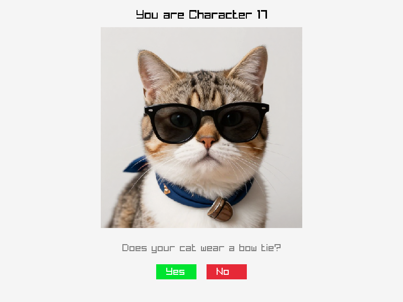
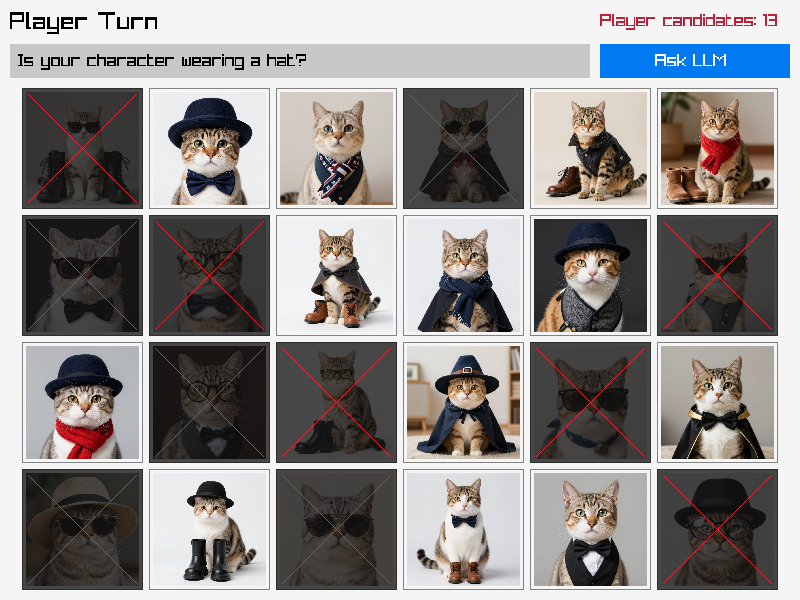
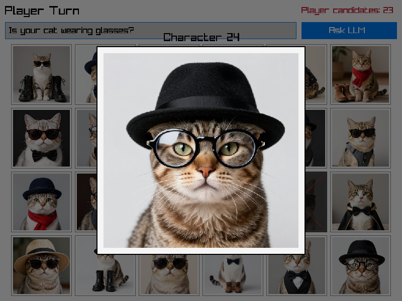

# Guess Llama? Game

## Description

This project is a C version of "Guess Who?" built with Raylib, libcurl, Jansson, and pthreads. It uses an LLM to generate themes and character traits, then uses a `stable-diffusion.cpp` server to create the character art the LLM reasons over during play.


## Screenshot





## Project Layout

```text
guess_llama.c        Main UI loop and game-state transitions
guess_llama.h        Shared constants, globals, and cross-module interfaces
game_state.c         Global game state/config definitions and shared cleanup
game_setup.c         Setup thread, theme loading, character assignment, image batch startup
gameplay.c           LLM guessing round and yes/no interaction flow
llm_backend.c        LLM HTTP calls, vision payloads, and response cleanup helpers
stable-diffusion.c   stable-diffusion.cpp backend/image generation logic used by the game
storage.c            Theme directory helpers and JSON save/load logic
```

## Features

- Dynamic theme selection from user input or the LLM.
- AI-generated feature lists for 24 characters per game.
- Stable Diffusion image generation with progress updates in the Raylib UI.
- Reusable image/theme directories under `images/<theme_name>/`.
- Vision-based LLM guessing rounds with yes/no answers in the GUI.
- Right-click character zoom preview during elimination (any left/right click closes it).

## Dependencies

- `curl` for HTTP requests
- `jansson` for JSON parsing/serialization
- `raylib` for the GUI
- `pthread` for setup and image-generation threading

## Build

```bash
make
```

To clean build artifacts:

```bash
make clean
```

Manual compile equivalent:

```bash
gcc -std=gnu11 -D_GNU_SOURCE -Wall -Wextra -g \
  guess_llama.c game_state.c llm_backend.c storage.c gameplay.c game_setup.c stable-diffusion.c \
  -o guess_llama -lcurl -ljansson -lraylib -lpthread
```


## Configuration

Runtime configuration is read with this precedence (highest first):

1. Existing process environment variables
2. `.env.local`
3. `.env`
4. Built-in defaults

Supported variables:

- `GUESS_LLAMA_SERVER_URL` (default: `localhost:1234`)
- `GUESS_LLAMA_LLM_SERVER` (default: `http://localhost:9090`)
- `GUESS_LLAMA_LLM_API_KEY` (default: empty, no Authorization header sent)
- `GUESS_LLAMA_LLM_MODEL` (default: `qwen3.5`)

OpenRouter note:

- Set `GUESS_LLAMA_LLM_SERVER` to `https://openrouter.ai/api` (not `https://openrouter.ai/api/v1`, because the game appends `/v1/chat/completions` internally).
- Set `GUESS_LLAMA_LLM_API_KEY` to your OpenRouter key.
- Set `GUESS_LLAMA_LLM_MODEL` to an OpenRouter model slug such as `openai/gpt-4o-mini`.

Linux/macOS example:

```bash
export GUESS_LLAMA_SERVER_URL="127.0.0.1:1234"
export GUESS_LLAMA_LLM_SERVER="http://127.0.0.1:9090"
export GUESS_LLAMA_LLM_API_KEY=""
export GUESS_LLAMA_LLM_MODEL="qwen3.5"
./guess_llama
```

`.env` file example:

```dotenv
GUESS_LLAMA_SERVER_URL=127.0.0.1:1234
GUESS_LLAMA_LLM_SERVER=http://127.0.0.1:9090
GUESS_LLAMA_LLM_API_KEY=
GUESS_LLAMA_LLM_MODEL=qwen3.5
```

`.env` OpenRouter example:

```dotenv
GUESS_LLAMA_SERVER_URL=127.0.0.1:1234
GUESS_LLAMA_LLM_SERVER=https://openrouter.ai/api
GUESS_LLAMA_LLM_API_KEY=sk-or-v1-...
GUESS_LLAMA_LLM_MODEL=qwen/qwen3.5-122b-a10b
```

PowerShell example:

```powershell
$env:GUESS_LLAMA_SERVER_URL = "127.0.0.1:1234"
$env:GUESS_LLAMA_LLM_SERVER = "http://127.0.0.1:9090"
$env:GUESS_LLAMA_LLM_API_KEY = ""
$env:GUESS_LLAMA_LLM_MODEL = "qwen3.5"
./guess_llama.exe
```

## Running

```bash
./guess_llama
```

1. Enter a theme or click `LLM Random Theme`.
2. Press `ENTER` for a manual theme, then press `SPACE` to start setup.
3. If an image directory for that theme already exists, choose whether to reuse it or regenerate it.
4. Wait for feature generation, save/load of game data, and image generation.
5. Click `Start Guessing Round` and answer the LLM's yes/no question.

During the player's elimination phase:

- Left-click a character card to toggle eliminated/not eliminated.
- Right-click a character card to open a centered zoom preview.
- Click either mouse button to close the zoom preview.

## Notes

- Generated assets and game metadata are stored in `images/<formatted_theme>/`.
- `game_data.json` is reused when you keep existing theme data.
- The LLM currently reasons over generated PNGs saved as `character_<n>.png`.
